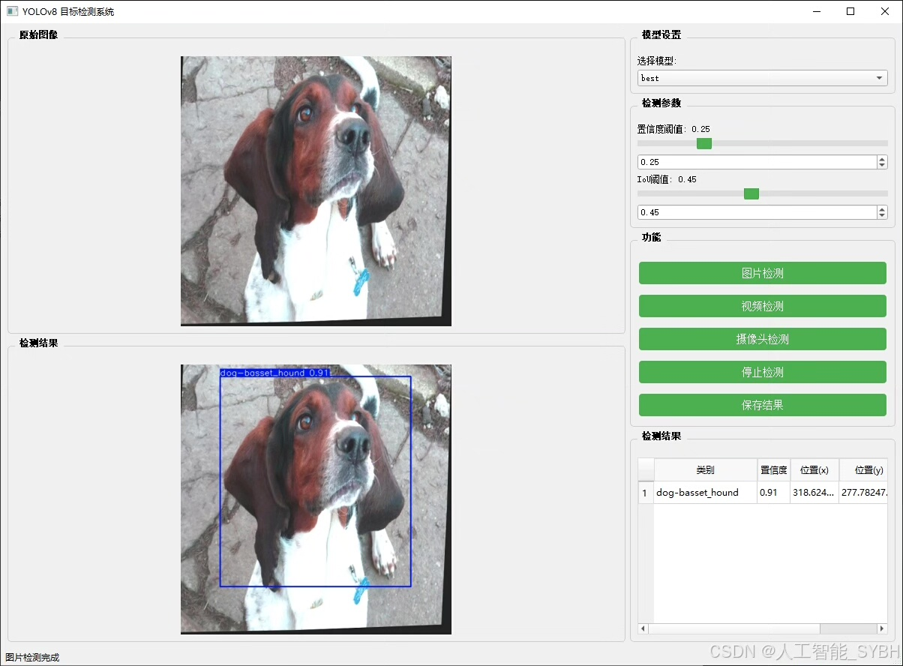
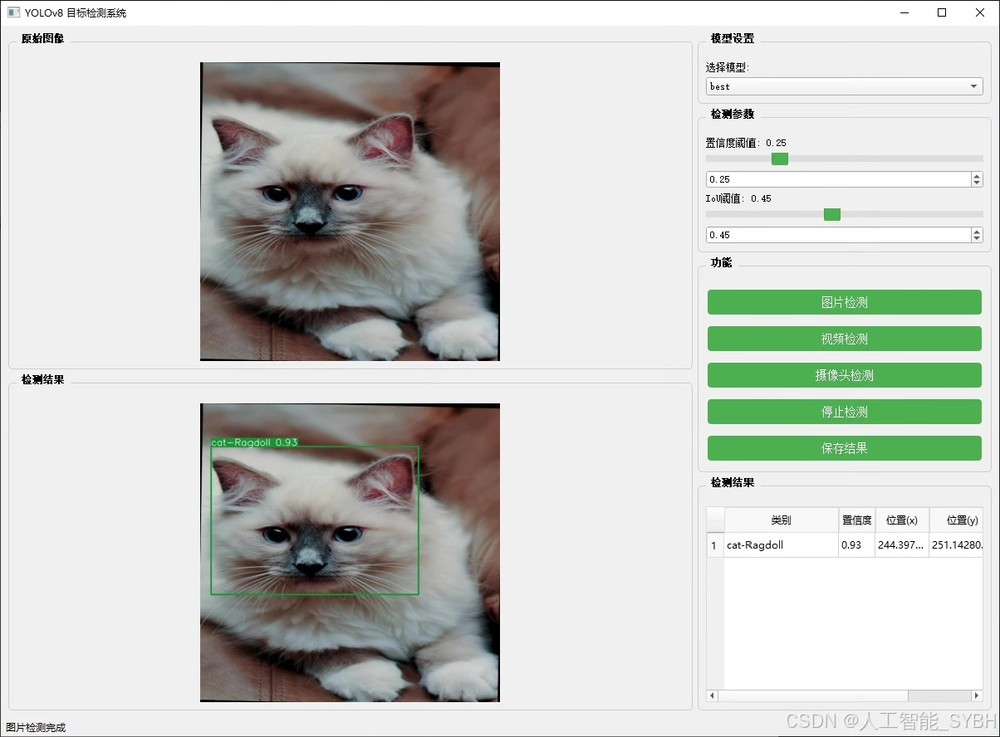
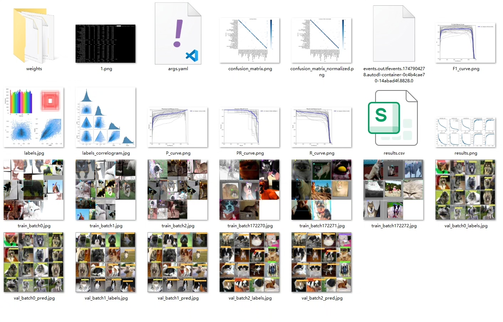
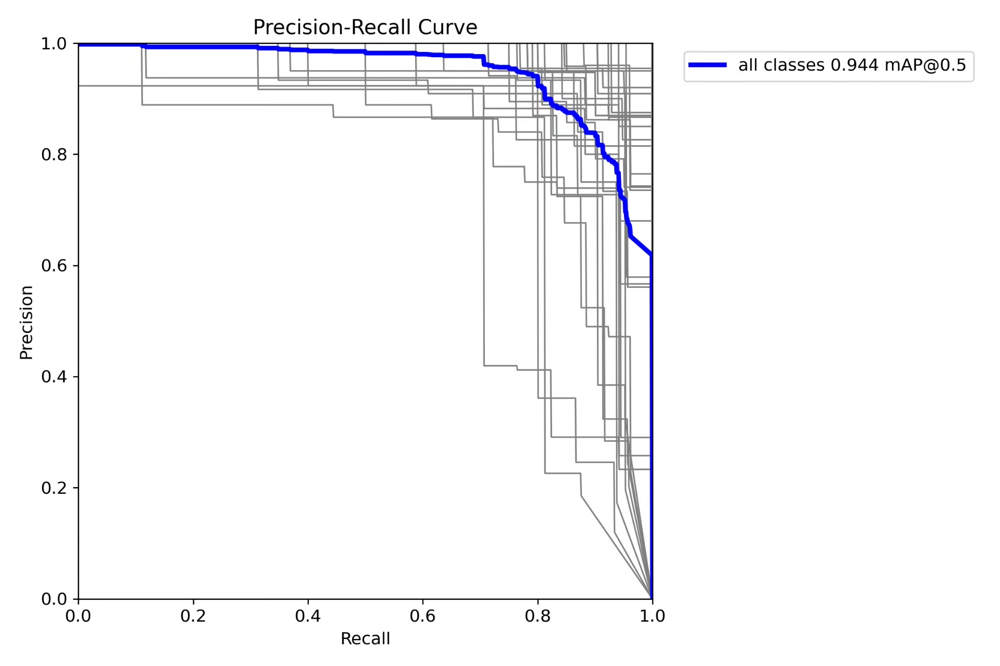
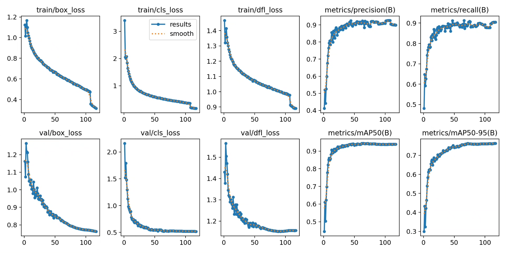
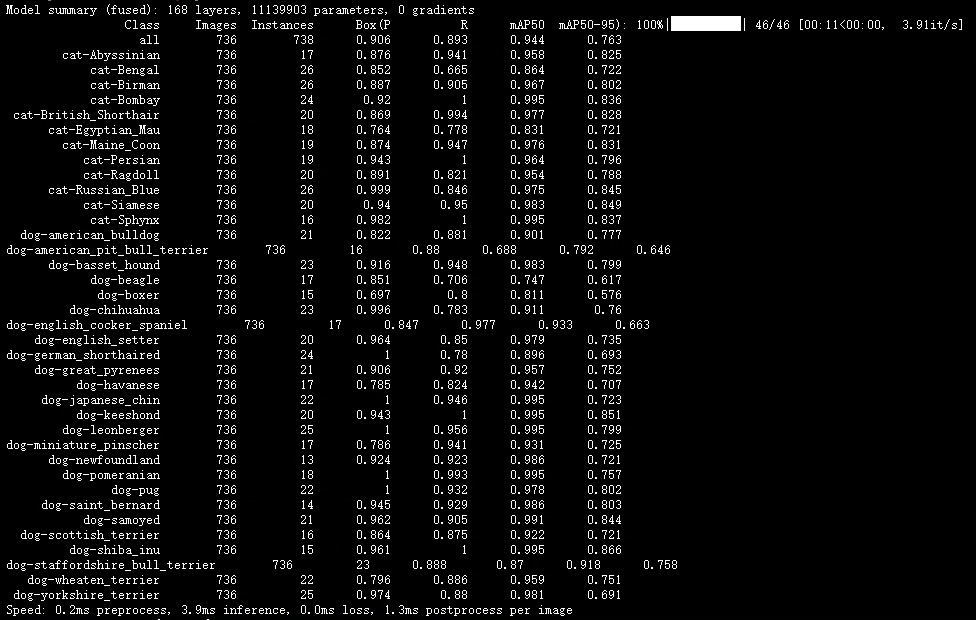
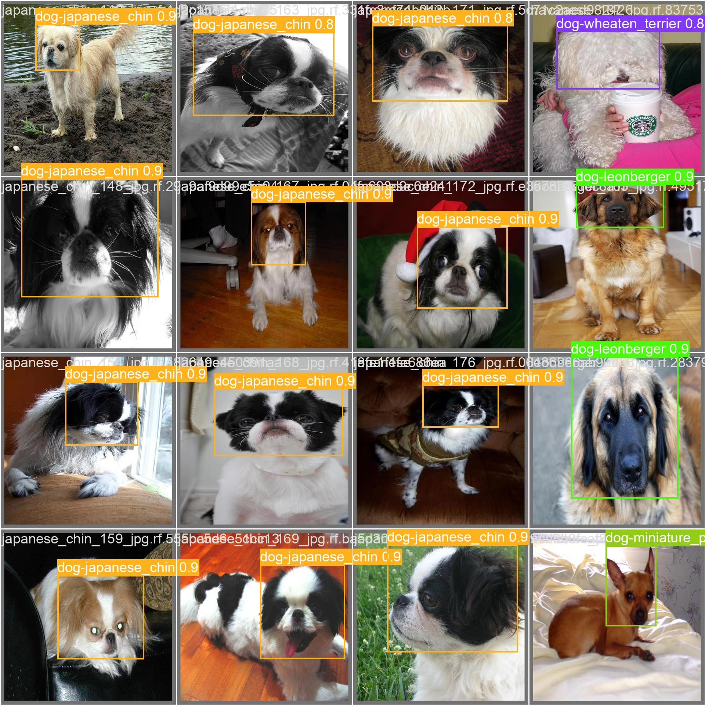
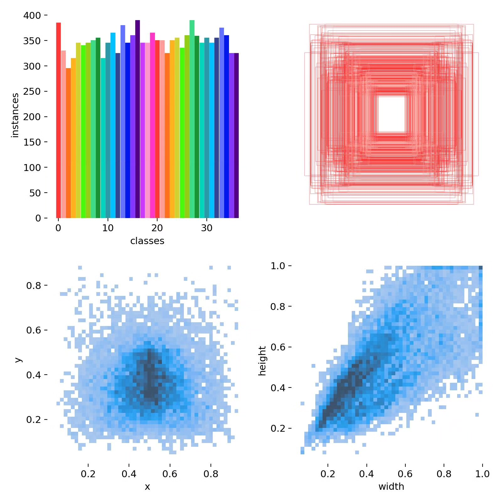

# Based on deep learning YOLOv8, a cat and dog breed recognition detection system

## Body

YOLOv8 is a deep learning-based object detection system that can identify and detect cats and dogs. It uses convolutional neural networks to recognize objects in real-time, with high accuracy and efficiency. The YOLOv8 model has been trained on a large dataset of images, which helps it to learn the characteristics of different cat and dog breeds.

The YOLOv8 system consists of three main components: the YOLOv8 model, the data preprocessing module, and the output module. The YOLOv8 model is responsible for recognizing and detecting objects in real-time, while the data preprocessing module is used to preprocess the input images and extract relevant features. Finally, the output module displays the results of the detection and provides feedback to the user.

The YOLOv8 system has many advantages over traditional object detection systems, such as faster processing speed, higher accuracy, and lower computational requirements. It can be used in various applications, such as security monitoring, animal tracking, and wildlife conservation.

(Full product description was not available from the source page.)

## Images

## Payment

Here is a pay link on Stripe ( https://buy.stripe.com/3cs8yP7sY87d0vu9AB ). Please contact me lonlonago@foxmail.com after funding $89, and I will send you a complete data files , thank you!

